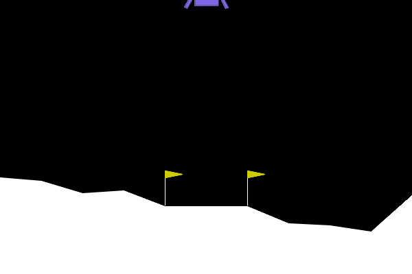

# 🌙 LunarLander Agent RL

Entraînement et déploiement d'un agent RL DQN pour atterrir la fusée sur la Lune dans l'environnement **Gymnasium LunarLander-v3**.



## 📋 Vue d'ensemble

Ce projet combine :

- **Notebooks** : Entraînement et optimisation des hyperparamètres du modèle DQN
- **Interface GUI** : Tableaux de bord pour jouer et analyser les performances
- **API FastAPI** : Backend pour les prédictions du modèle

### 🎮 Environnement

[Gymnasium LunarLander-v3](https://gymnasium.farama.org/environments/box2d/lunar_lander/) - Simulateur de vol lunaire classique

**Observation** : 8 floats `[x, y, vx, vy, angle, angular_velocity, left_contact, right_contact]`  
**Acciones** : 4 actions discrètes `[0=Aucun, 1=Gauche, 2=Droite, 3=Moteur]`  
**Objectif** : Score ≥ 200 points (atterrissage réussi)

---

## 🚀 Installation

### Prérequis

- Python 3.10+
- `uv` (gestionnaire de paquets Python)

### Installation des dépendances

```bash
uv add stable-baselines3 gymnasium gymnasium-box2d fastapi uvicorn streamlit pandas plotly
```

Ou simplement :

```bash
uv sync
```

---

## 📊 Notebooks

### 1. **01_baseline.ipynb**

Crée les modèles baseline et teste plusieurs algorithmes :

- **Random Agent** : Prédictions aléatoires
- **DQN** : Deep Q-Network
- **PPO** : Proximal Policy Optimization

### 2. **02_optimization.ipynb**

8 expériences d'optimisation des hyperparamètres DQN :

- Learning Rate (0.0001, 0.0005)
- Buffer Size (50k, 100k)
- Batch Size (32, 64, 128)
- Exploration Fraction (0.3, 0.5)
- Gamma (0.99, 0.999)
- Target Update Interval (250, 500, 1000)
- Et autres...

**Meilleur résultat** : EXP_8 avec score **241.33 ± 36.91** ✅

---

## 🎮 Interface GUI

### Mode de fonctionnement

```
Terminal 1                   Terminal 2 (ou make dev)
  API FastAPI        ↔→←      Streamlit Frontend
  (port 8000)      Prédictions  (port 8501)
                    & Logging
```

### Démarrage rapide

**Option 1 : Avec Makefile**

```bash
make dev        # Lance API + Streamlit ensemble
```

**Option 2 : Manuellement**

```bash
# Terminal 1
uv run python -m uvicorn api.main:app --reload --host 127.0.0.1 --port 8000

# Terminal 2
uv run streamlit run frontend/app.py
```

### Accès

- 🎮 **Interface** : http://localhost:8501
- 📖 **API Docs** : http://127.0.0.1:8000/docs

---

## 📱 Pages de l'interface

### 🏠 **Home (app.py)**

Landing page avec infos du projet

### 🎮 **Play (pages/01_play.py)**

- Jouez contre l'agent DQN entraîné
- Visualisez l'atterrissage en temps réel
- Consultez score, steps, actions prises
- **Chaque partie est loggée automatiquement**

### 📊 **Analytics (pages/02_analytics.py)**

Tableau de bord avec :

- Nombre de parties jouées
- Score moyen & taux de succès
- Courbe d'évolution du score
- Distribution des scores
- Répartition réussite/crash
- Fréquence des actions prises
- Historique complet des sessions

---

## 📁 Structure du projet

```
.
├── main.py                         # Point d'entrée principal
├── Makefile                        # Raccourcis de commandes
├── pyproject.toml                  # Dépendances (uv)
│
├── notebooks/                      # 📓 Notebooks Jupyter
│   ├── 01_baseline.ipynb           # Baseline + algorithmes
│   └── 02_optimization.ipynb       # Optimisation hyperparamètres
│
├── api/                            # 🔧 Backend FastAPI
│   ├── main.py                     # Application FastAPI
│   ├── routes.py                   # Endpoints API
│   ├── agent_service.py            # Chargement modèle DQN
│   ├── logger_service.py           # Logging des sessions
│   ├── config.py                   # Constantes
│   └── schemas.py                  # Schémas Pydantic
│
├── frontend/                       # 🎨 Frontend Streamlit
│   ├── app.py                      # Page accueil
│   └── pages/
│       ├── 01_play.py              # Jeu interactif
│       └── 02_analytics.py         # Dashboard analytics
│
├── models/                         # 🤖 Modèles pré-entraînés
│   ├── modele_final.zip            # Meilleur modèle DQN
│   └── modele_final_metadata.json   # Métadonnées
│
└── data/                           # 📊 Données
    ├── game_sessions.jsonl         # Logs des parties
    ├── baseline_results.json        # Résultats baseline
    ├── logs/                       # TensorBoard events
    └── videos/                     # Vidéos (optionnel)
```

---

## 🔌 API Endpoints

### **GET /health**

Vérifier l'état de l'API

```bash
curl http://127.0.0.1:8000/health
```

### **POST /predict**

Prédire une action

```bash
curl -X POST http://127.0.0.1:8000/predict \
  -H "Content-Type: application/json" \
  -d '{"observation": [0.0, 1.4, 0.0, 0.0, 0.0, 0.0, 0.0, 0.0]}'
```

### **POST /log-game**

Logger une session de jeu

```bash
curl -X POST http://127.0.0.1:8000/log-game \
  -H "Content-Type: application/json" \
  -d '{
    "score": 150.5,
    "steps": 500,
    "actions": [0, 3, 3, 2, 1],
    "success": true
  }'
```

---

## 📊 Monitorer avec TensorBoard

```bash
tensorboard --logdir=data/logs --port=6006
```

Accédez à http://localhost:6006 pour voir les courbes d'entraînement

---

## 🛠️ Commandes Makefile

```bash
make api              # Lancer seulement l'API
make frontend         # Lancer seulement Streamlit
make dev              # Lancer API + Streamlit
make stop             # Arrêter tous les services
make help             # Afficher l'aide
```

---

## 🎬 Générer un GIF de démo

Si vous voulez créer votre propre GIF animé du agent en action :

```bash
python scripts/generate_demo_gif.py
```

Le GIF sera sauvegardé dans `assets/demo_lunar_lander.gif` (⚠️ remplacera l'existant)

---

## 🔗 Ressources

- [Gymnasium Docs](https://gymnasium.farama.org/)
- [Stable-Baselines3](https://stable-baselines3.readthedocs.io/)
- [FastAPI](https://fastapi.tiangolo.com/)
- [Streamlit](https://streamlit.io/)
